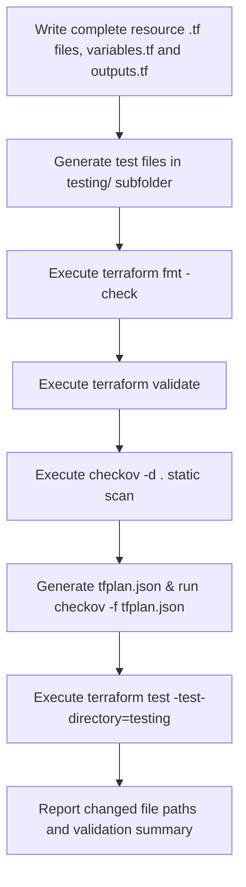

# Skill: Terraform Verification and Quality Assurance (LLM-Agnostic)

This skill instructs the agent on how to write native Terraform test suites, handle security scanning, and enforce clean syntax execution alongside aggressive destroy prevention rules.

## 1. Test Generation Rules

When writing tests, use native Terraform testing capabilities (`.tftest.hcl` files). All test assertions must reside within the `testing/` subdirectory.

### Test Structure Checklist
* **Run Blocks:** Use descriptive names for `run` blocks indicating what phase or attribute is under test.
* **Assertions:** Write explicit error messages within your `assert` blocks to pinpoint what broke.
* **Input Isolation:** Pass variable blocks inside the test files to check happy paths and boundary edge cases.

---

## 2. Security & Destroy Compliance Gate

You must evaluate all configurations against compliance frameworks using **Checkov** across both static declarations and calculated plans.

### Custom Rule Execution: Destroy Safeguards
To intercept unapproved deletions, you must render the planned execution graph to JSON format and scan it. Checkov flags resource changes where the plan array includes `delete` actions without an accompanying create modification (`replace`), or items missing from the allow-list.

#### Plan Scanning Workflow:
```bash
# 1. Initialize and build the planned execution payload
terraform init
terraform plan -out=tfplan.binary

# 2. Convert to human/machine readable JSON for Checkov inspection
terraform show -json tfplan.binary > tfplan.json

# 3. Target the plan file using Checkov's structural enforcement engine
checkov -f tfplan.json
```

### Destruction Exceptions & Allow-Lists
If you intentionally need to destroy or decommission a resource, you must consult `testing/.checkov-allowlist.json`. If a resource target is listed, append an inline suppression tag or checkov framework skip flag targeting the specific resource reference:

```hcl
resource "aws_instance" "ephemeral_worker" {
  ami           = "ami-12345678"
  instance_type = "t3.micro"

  lifecycle {
    # Guard against accidental deletion during direct apply updates
    prevent_destroy = false 
  }
  
  # checkov:skip=CKV_TF_1: "Approved for deletion per tracking ticket inside testing/.checkov-allowlist.json"
}
```

---

## 3. Step-by-Step Validation Workflow

Execute these steps in sequence every time you alter infrastructure resources:



1. **Lint:** Run `terraform fmt`. Fix any layout or alignment anomalies.
2. **Validate:** Run `terraform validate` to catch mismatched types or missing arguments.
3. **Static Scan:** Trigger `checkov -d .` to verify compliance parameters.
4. **Plan & Destroy Analysis:** Convert a valid `terraform plan` output to JSON. Scan it using `checkov -f tfplan.json` to confirm no unexpected resource purges or state deletions are being requested.
5. **Test Suite:** Execute `terraform test -test-directory=testing`. Ensure all `run` and `assert` blocks pass cleanly.
6. **Report:** Present the full console logs or summaries of these validations back to the user, with the paths of the files you created or changed. Do not print the file contents.
